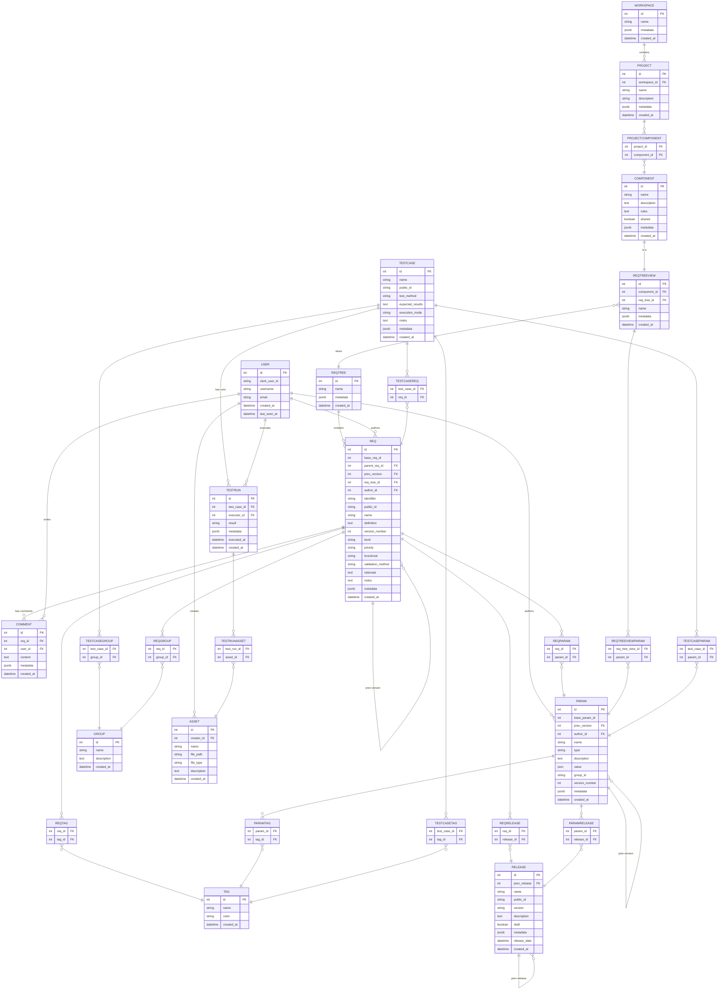

# Entity Relationship Diagram

```mermaid
erDiagram
    WORKSPACE {
        int id PK
        string name
        jsonb metadata
        datetime created_at
    }

    PROJECT {
        int id PK
        int workspace_id FK
        string name
        string description
        jsonb metadata
        datetime created_at
    }

    USER {
        int id PK
        string clerk_user_id
        string username
        string email
        datetime created_at
        datetime last_seen_at
    }

    REQTREE {
        int id PK
        string name
        jsonb metadata
        datetime created_at
    }

    COMPONENT {
        int id PK
        string name
        text description
        text rules
        boolean shared
        jsonb metadata
        datetime created_at
    }

    REQTREEVIEW {
        int id PK
        int component_id FK
        int req_tree_id FK
        string name
        jsonb metadata
        datetime created_at
    }

    REQ {
        int id PK
        int base_req_id
        int parent_req_id FK
        int prev_version FK
        int req_tree_id FK
        int author_id FK
        string identifier
        string public_id
        string name
        text definition
        int version_number
        string level
        string priority
        string functional
        string validation_method
        text rationale
        text notes
        jsonb metadata
        datetime created_at
    }

    PARAM {
        int id PK
        int base_param_id
        int prev_version FK
        int author_id FK
        string name
        string type
        text description
        json value
        string group_id
        int version_number
        jsonb metadata
        datetime created_at
    }

    TAG {
        int id PK
        string name
        string color
        datetime created_at
    }

    RELEASE {
        int id PK
        int prev_release FK
        string name
        string public_id
        string version
        text description
        boolean draft
        jsonb metadata
        datetime release_date
        datetime created_at
    }

    COMMENT {
        int id PK
        int req_id FK
        int user_id FK
        text content
        jsonb metadata
        datetime created_at
    }

    GROUP {
        int id PK
        string name
        text description
        datetime created_at
    }

    TESTCASE {
        int id PK
        string name
        string public_id
        string test_method
        text expected_results
        string execution_mode
        text notes
        jsonb metadata
        datetime created_at
    }

    TESTRUN {
        int id PK
        int test_case_id FK
        int executor_id FK
        string result
        jsonb metadata
        datetime executed_at
        datetime created_at
    }

    ASSET {
        int id PK
        int creator_id FK
        string name
        string file_path
        string file_type
        text description
        datetime created_at
    }

    %% Junction Tables
    PROJECTCOMPONENT {
        int project_id FK
        int component_id FK
    }

    REQPARAM {
        int req_id FK
        int param_id FK
    }

    REQTAG {
        int req_id FK
        int tag_id FK
    }

    PARAMTAG {
        int param_id FK
        int tag_id FK
    }

    REQTREEVIEWPARAM {
        int req_tree_view_id FK
        int param_id FK
    }

    TESTCASEREQ {
        int test_case_id FK
        int req_id FK
    }

    TESTCASEPARAM {
        int test_case_id FK
        int param_id FK
    }

    TESTCASEGROUP {
        int test_case_id FK
        int group_id FK
    }

    REQGROUP {
        int req_id FK
        int group_id FK
    }

    TESTCASETAG {
        int test_case_id FK
        int tag_id FK
    }

    TESTRUNASSET {
        int test_run_id FK
        int asset_id FK
    }

    REQRELEASE {
        int req_id FK
        int release_id FK
    }

    PARAMRELEASE {
        int param_id FK
        int release_id FK
    }

    %% Direct Relationships
    WORKSPACE ||--o{ PROJECT : contains
    COMPONENT ||--|| REQTREEVIEW : "is a"
    REQTREEVIEW }o--|| REQTREE : "views"
    REQTREE ||--o{ REQ : "contains"

    REQ ||--o{ REQ : "parent-child"
    REQ ||--o{ REQ : "prev-version"
    REQ ||--o{ COMMENT : "has comments"

    PARAM ||--o{ PARAM : "prev-version"
    TESTCASE ||--o{ TESTRUN : "has runs"

    USER ||--o{ REQ : "authors"
    USER ||--o{ PARAM : "authors"
    USER ||--o{ COMMENT : "writes"
    USER ||--o{ TESTRUN : "executes"
    USER ||--o{ ASSET : "creates"

    %% Many-to-Many through junction tables
    PROJECT ||--o{ PROJECTCOMPONENT : ""
    PROJECTCOMPONENT }o--|| COMPONENT : ""

    REQ ||--o{ REQPARAM : ""
    REQPARAM }o--|| PARAM : ""

    REQ ||--o{ REQTAG : ""
    REQTAG }o--|| TAG : ""

    PARAM ||--o{ PARAMTAG : ""
    PARAMTAG }o--|| TAG : ""

    REQTREEVIEW ||--o{ REQTREEVIEWPARAM : ""
    REQTREEVIEWPARAM }o--|| PARAM : ""

    TESTCASE ||--o{ TESTCASEREQ : ""
    TESTCASEREQ }o--|| REQ : ""

    TESTCASE ||--o{ TESTCASEPARAM : ""
    TESTCASEPARAM }o--|| PARAM : ""

    TESTCASE ||--o{ TESTCASEGROUP : ""
    TESTCASEGROUP }o--|| GROUP : ""

    REQ ||--o{ REQGROUP : ""
    REQGROUP }o--|| GROUP : ""

    TESTCASE ||--o{ TESTCASETAG : ""
    TESTCASETAG }o--|| TAG : ""

    TESTRUN ||--o{ TESTRUNASSET : ""
    TESTRUNASSET }o--|| ASSET : ""

    REQ ||--o{ REQRELEASE : ""
    REQRELEASE }o--|| RELEASE : ""

    PARAM ||--o{ PARAMRELEASE : ""
    PARAMRELEASE }o--|| RELEASE : ""

    RELEASE ||--o{ RELEASE : "prev-release"
```
