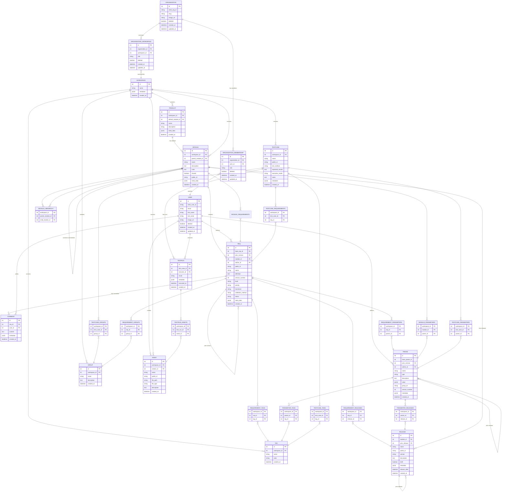

# Entity Relationship Diagram - Simplified Architecture

```mermaid
erDiagram
    WORKSPACE {
        int id PK
        string name
        jsonb metadata
        datetime created_at
    }

    PRODUCT {
        int id PK
        int workspace_id FK
        int default_module_id FK
        string name
        string description
        jsonb meta_data
        datetime created_at
    }

    USER {
        int id PK
        string clerk_user_id
        string email
        string first_name
        string last_name
        string image_url
        boolean deleted
        datetime created_at
        datetime updated_at
    }

    ORGANIZATION {
        int id PK
        string clerk_org_id
        string slug
        string image_url
        boolean deleted
        datetime created_at
        datetime updated_at
    }


    MODULE {
        int id PK
        int workspace_id FK
        int parent_module_id FK
        string name
        text description
        text rules
        boolean shared
        string public_id
        jsonb meta_data
        datetime created_at
    }


    REQ {
        int id PK
        int base_req_id FK
        int prev_version FK
        int module_id FK
        int author_id FK
        string public_id
        string name
        text definition
        int version_number
        string level
        string priority
        string functional
        string validation_method
        string status
        jsonb meta_data
        datetime created_at
    }

    PARAM {
        int id PK
        int base_param_id
        int prev_version FK
        int author_id FK
        string name
        string type
        text description
        jsonb value
        string group_id
        int version_number
        jsonb metadata
        datetime created_at
    }

    TAG {
        int id PK
        int workspace_id FK
        string name
        string color
        datetime created_at
    }

    RELEASE {
        int id PK
        int module_id FK
        int prev_release FK
        string name
        string public_id
        string version
        text description
        boolean draft
        jsonb metadata
        datetime release_date
        datetime created_at
    }

    COMMENT {
        int id PK
        int req_id FK
        int user_id FK
        text content
        jsonb metadata
        datetime created_at
    }

    GROUP {
        int id PK
        int workspace_id FK
        string name
        text description
        datetime created_at
    }

    TESTCASE {
        int id PK
        int workspace_id FK
        string name
        string public_id
        string test_method
        text expected_results
        string execution_mode
        text notes
        jsonb metadata
        datetime created_at
    }

    TESTRUN {
        int id PK
        int test_case_id FK
        int executor_id FK
        string result
        jsonb metadata
        datetime executed_at
        datetime created_at
    }

    ASSET {
        int id PK
        int workspace_id FK
        int creator_id FK
        string name
        string public_id
        string file_path
        string file_type
        text description
        datetime created_at
    }

    %% Junction Tables
    ORGANIZATION_MEMBERSHIP {
        int id PK
        int organization_id FK
        int user_id FK
        string role
        boolean deleted
        datetime created_at
        datetime updated_at
    }

    ORGANIZATION_WORKSPACE {
        int id PK
        int organization_id FK
        int workspace_id FK
        string role
        boolean deleted
        datetime created_at
        datetime updated_at
    }

    MODULE_HIERARCHY {
        int workspace_id FK
        int parent_module_id FK
        int child_module_id FK
    }

    REQUIREMENT_PARAMETERS {
        int workspace_id FK
        int req_id FK
        int param_id FK
    }

    REQUIREMENT_TAGS {
        int workspace_id FK
        int req_id FK
        int tag_id FK
    }

    PARAMETER_TAGS {
        int workspace_id FK
        int param_id FK
        int tag_id FK
    }

    MODULE_PARAMETERS {
        int workspace_id FK
        int module_id FK
        int param_id FK
    }


    TESTCASE_REQUIREMENTS {
        int workspace_id FK
        int test_case_id FK
        int req_id FK
    }

    TESTCASE_PARAMETERS {
        int workspace_id FK
        int test_case_id FK
        int param_id FK
    }

    TESTCASE_GROUPS {
        int workspace_id FK
        int test_case_id FK
        int group_id FK
    }

    REQUIREMENT_GROUPS {
        int workspace_id FK
        int req_id FK
        int group_id FK
    }

    TESTCASE_TAGS {
        int workspace_id FK
        int test_case_id FK
        int tag_id FK
    }

    TESTRUN_ASSETS {
        int workspace_id FK
        int test_run_id FK
        int asset_id FK
    }

    REQUIREMENT_RELEASES {
        int workspace_id FK
        int req_id FK
        int release_id FK
    }

    PARAMETER_RELEASES {
        int workspace_id FK
        int param_id FK
        int release_id FK
    }

    %% Direct Relationships
    WORKSPACE ||--o{ PRODUCT : contains
    PRODUCT ||--o{ MODULE : "has default"
    MODULE ||--o{ MODULE : "contains sub-modules"
    MODULE ||--o{ REQ : "contains"

    REQ ||--o{ REQ : "base-version"
    REQ ||--o{ REQ : "prev-version"
    REQ ||--o{ COMMENT : "has comments"

    PARAM ||--o{ PARAM : "prev-version"
    TESTCASE ||--o{ TESTRUN : "has runs"

    USER ||--o{ REQ : "authors"
    USER ||--o{ PARAM : "authors"
    USER ||--o{ COMMENT : "writes"
    USER ||--o{ TESTRUN : "executes"
    USER ||--o{ ASSET : "creates"

    ORGANIZATION ||--o{ ORGANIZATION_MEMBERSHIP : "has members"
    ORGANIZATION_MEMBERSHIP }o--|| USER : "member"

    ORGANIZATION ||--o{ ORGANIZATION_WORKSPACE : "accesses"
    ORGANIZATION_WORKSPACE }o--|| WORKSPACE : "accessed by"

    WORKSPACE ||--o{ TESTCASE : "contains"
    WORKSPACE ||--o{ TAG : "contains"
    WORKSPACE ||--o{ GROUP : "contains"
    WORKSPACE ||--o{ ASSET : "contains"
    WORKSPACE ||--o{ MODULE : "contains"

    %% Many-to-Many through junction tables
    MODULE ||--o{ MODULE_HIERARCHY : ""
    MODULE_HIERARCHY }o--|| MODULE : ""

    REQ ||--o{ REQUIREMENT_PARAMETERS : ""
    REQUIREMENT_PARAMETERS }o--|| PARAM : ""

    REQ ||--o{ REQUIREMENT_TAGS : ""
    REQUIREMENT_TAGS }o--|| TAG : ""

    PARAM ||--o{ PARAMETER_TAGS : ""
    PARAMETER_TAGS }o--|| TAG : ""

    MODULE ||--o{ MODULE_PARAMETERS : ""
    MODULE_PARAMETERS }o--|| PARAM : ""

    MODULE ||--o{ MODULE_REQUIREMENTS : ""
    MODULE_REQUIREMENTS }o--|| REQ : ""

    TESTCASE ||--o{ TESTCASE_REQUIREMENTS : ""
    TESTCASE_REQUIREMENTS }o--|| REQ : ""

    TESTCASE ||--o{ TESTCASE_PARAMETERS : ""
    TESTCASE_PARAMETERS }o--|| PARAM : ""

    TESTCASE ||--o{ TESTCASE_GROUPS : ""
    TESTCASE_GROUPS }o--|| GROUP : ""

    REQ ||--o{ REQUIREMENT_GROUPS : ""
    REQUIREMENT_GROUPS }o--|| GROUP : ""

    TESTCASE ||--o{ TESTCASE_TAGS : ""
    TESTCASE_TAGS }o--|| TAG : ""

    TESTRUN ||--o{ TESTRUN_ASSETS : ""
    TESTRUN_ASSETS }o--|| ASSET : ""

    REQ ||--o{ REQUIREMENT_RELEASES : ""
    REQUIREMENT_RELEASES }o--|| RELEASE : ""

    PARAM ||--o{ PARAMETER_RELEASES : ""
    PARAMETER_RELEASES }o--|| RELEASE : ""

    RELEASE ||--o{ RELEASE : "prev-release"
    MODULE ||--o{ RELEASE : "has releases"

    %% Composite Unique Constraints (Database Implementation)
    %% REQ: UNIQUE(req_collection_id->workspace_id, public_id) - workspace-scoped public_id uniqueness
    %% TESTCASE: UNIQUE(workspace_id, public_id) - workspace-scoped public_id uniqueness
    %% RELEASE: UNIQUE(module_id->workspace_id, public_id) - workspace-scoped public_id uniqueness
    %% ASSET: UNIQUE(workspace_id, public_id) - workspace-scoped public_id uniqueness
```
